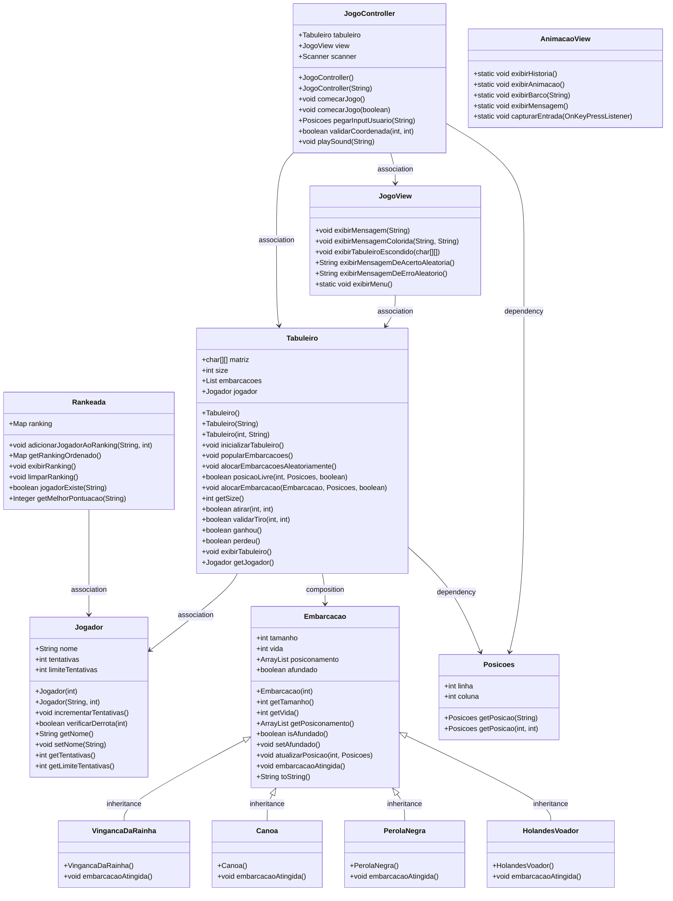

```

          ██████╗  █████╗ ████████╗ █████╗ ██╗     ██╗  ██╗ █████╗               ███╗   ██╗ █████╗ ██╗   ██╗ █████╗ ██╗     
          ██╔══██╗██╔══██╗╚══██╔══╝██╔══██╗██║     ██║  ██║██╔══██╗              ████╗  ██║██╔══██╗██║   ██║██╔══██╗██║     
          ██████╔╝███████║   ██║   ███████║██║     ███████║███████║    █████╗    ██╔██╗ ██║███████║██║   ██║███████║██║     
          ██╔══██╗██╔══██║   ██║   ██╔══██║██║     ██╔══██║██╔══██║    ╚════╝    ██║╚██╗██║██╔══██║╚██╗ ██╔╝██╔══██║██║     
          ██████╔╝██║  ██║   ██║   ██║  ██║███████╗██║  ██║██║  ██║              ██║ ╚████║██║  ██║ ╚████╔╝ ██║  ██║███████╗
          ╚═════╝ ╚═╝  ╚═╝   ╚═╝   ╚═╝  ╚═╝╚══════╝╚═╝  ╚═╝╚═╝  ╚═╝              ╚═╝  ╚═══╝╚═╝  ╚═╝  ╚═══╝  ╚═╝  ╚═╝╚══════╝
                                                                                                                  
 ```                                                                                                       

<div align="center">
  
</div>


## **Estrutura Principal**

Este projeto é um jogo de Batalha Naval desenvolvido em Java, utilizando conceitos de orientação a objetos para criar um jogo funcional e organizado. A estrutura do código segue boas práticas de desenvolvimento e permite uma fácil expansão futura.

---
## **História do Jogo**
**A Batalha de 1720:** Os mares são dominados pelo caos e pela violência, com piratas saqueando navios mercantes e espalhando o terror pelos oceanos. Você, um capitão experiente da marinha real, foi designado para restaurar a ordem e proteger os valiosos carregamentos que abastecem o império. Frente a frente com os piratas mais temidos e astutos, sua missão é localizar suas embarcações, esquivar-se de armadilhas traiçoeiras e afundar os navios piratas antes que eles levem tudo que você jurou proteger. Cada batalha é uma luta estratégica entre você e mentes criminosas que conhecem o oceano como a palma da mão. Você tem coragem para enfrentar a maré e derrotar os senhores do mar?

---
## **Funcionamento do Jogo**

### Início do Jogo ###
- O jogo começa com uma mensagem de boas-vindas exibida ao jogador.  
- Você será apresentado a um tabuleiro de jogo, inicialmente oculto, onde a batalha acontecerá.

### Modos de Jogo ###
#### Modo Normal ####
No Modo Normal, o jogador participa de uma partida padrão da Batalha de 1720 sem a necessidade de registrar sua pontuação no ranking. Este modo é ideal para quem deseja jogar por diversão ou para se familiarizar com as mecânicas do jogo sem a pressão competitiva.

Implementação Relacionada:
```
JogoController.comecarJogo()
Tabuleiro
```
#### Modo Rankeado ####
No Modo Rankeado, a partida é registrada no ranking de jogadores. Ao finalizar o jogo, a pontuação é avaliada e, se for uma das melhores, é adicionada ao ranking. Este modo é perfeito para jogadores que desejam competir e comparar suas pontuações com outros marinheiros.

Implementação Relacionada:
```
JogoController.comecarJogo(boolean modoRankeado)
Rankeada.adicionarJogadorAoRanking(String nomeJogador, int tentativas)
```
#### Interação do Jogador ####
- Para realizar um disparo, insira as **coordenadas** da célula alvo no formato: `A1`, `B2`, etc.  
- O jogo **valida as coordenadas** para garantir que sejam válidas antes de prosseguir.

#### Jogando o Jogo ####
**Tabuleiro**
- O tabuleiro será exibido com as **coordenadas das linhas e colunas**.  
- As células podem conter:  
  - `~` (água): Célula não atingida.  
  - `X` (acerto): Disparo bem-sucedido em uma embarcação.  
  - `O` (erro): Disparo que não acertou nenhuma embarcação.  

**Resultados do Disparo**
- Se o disparo acertar uma embarcação:  
  - A célula será marcada com **X**.  
  - Uma **mensagem de acerto** será exibida e um som de explosão será tocado.  
- Se o disparo errar:  
  - A célula será marcada com **O**.  
  - Uma **mensagem de erro** será exibida e um som de erro será tocado.  

**Condições de Vitória ou Derrota**
- O jogo continua até que:
  - Você tenha **afundado todas as embarcações** do oponente (**vitória**).  
  - Todas as suas embarcações sejam **afundadas** pelo oponente (**derrota**).  

**Feedback Visual e Sonoro**
- Mensagens coloridas indicam **acertos** e **erros**, proporcionando uma experiência mais rica.  
- **Efeitos sonoros** acompanham cada disparo para aumentar a imersão:  
  - **Explosões** para acertos.  
  - **Sons de erro** para disparos que erraram.

**Fim do Jogo**
- Se você **afundar todas as embarcações**, uma mensagem de **vitória** será exibida.  
- Caso contrário, uma mensagem de **derrota** indicará o fim do jogo.

**Controles**
- **Teclado:** Insira as coordenadas dos disparos.  
- **Enter:** Confirme suas ações.  
- Certifique-se de que o volume do seu dispositivo esteja ativado para aproveitar ao máximo a experiência sonora.

### **Observações:**

**Áudio**:
- O áudio não funciona corretamente no WSL. Você pode optar por rodar o jogo fora do WSL ou decidir jogar sem som.
- E para rodar com som, certifique-se de estar na pasta do `batalha-naval`.

**IntelliJ**: 
- Para rodar o jogo no IntelliJ, certifique-se de estar na pasta principal `batalha-naval`.
- Em seguida no terminal do IntelliJ, execute o comando:
     ```bash
     java src/Main.java
     ```

## **Arquitetura**
- **Main**: Classe principal responsável por iniciar e controlar o fluxo do jogo. ([Main.java](src/Main.java))
- **controller/JogoController**: Classe responsável por interagir com o Model e o View para processar a entrada do usuário. Gerencia a interação do usuário, processa os comandos e atualiza o Model e o View. ([JogoController.java](src/controller/JogoController.java))
- **view/JogoView**: Classe responsável por exibir ao usuário o tabuleiro, mensagens e ações. Também utiliza cores para melhorar a UX. ([JogoView.java](src/view/JogoView.java))
- **view/AnimacaoView**: Classe responsável por exibir animações durante o jogo. ([AnimacaoView.java](src/view/AnimacaoView.java))
- **model/Tabuleiro**: Classe que representa o tabuleiro do jogo com métodos para inicializar e atualizar o estado do tabuleiro ao decorrer da partida. ([Tabuleiro.java](src/model/Tabuleiro.java))
- **model/Embarcacao**: Classe abstrata que generaliza uma embarcação. ([Embarcacao.java](src/model/Embarcacao.java))
- **model/PerolaNegra**: Representa tipo de embarcação individual. ([Cruzador.java](src/model/PerolaNegra.java))
- **model/HolandesVoador**: Representa tipo de embarcação individual. ([PortaAviao.java](src/model/HolandesVoador.java))
- **model/VingancaDaRainha**: Representa tipo de embarcação individual. ([Cargueiro.java](src/model/VingancaDaRainha.java))
- **model/Canoa**: Representa tipo de embarcação individual. ([Submarino.java](src/model/Canoa.java))
- **model/Jogador**: Classe que representa o jogador, com métodos para controlar tentativas e verificar derrota. ([Jogador.java](src/model/Jogador.java))
- **model/Posicoes**: Enumeração que representa as posições no tabuleiro, com métodos para obter posições por coordenadas. ([Posicoes.java](src/model/Posicoes.java))
- **model/Rankeada**: Classe responsável por gerenciar o ranking dos jogadores. ([Rankeada.java](src/model/Rankeada.java))

### **UML**

